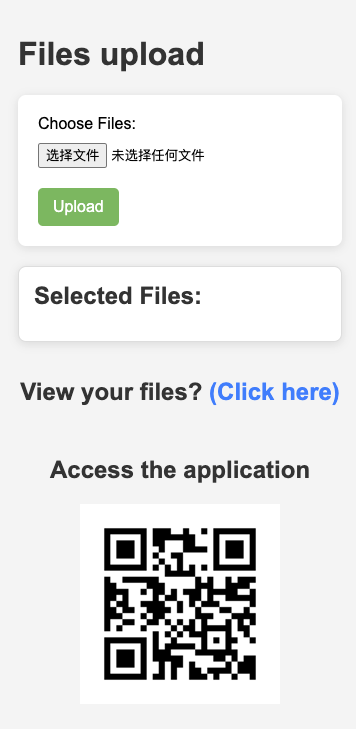
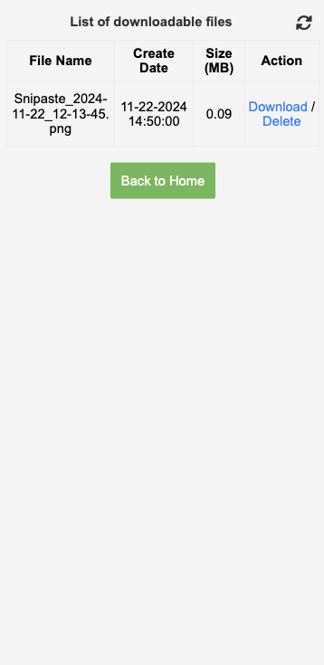

# Share Files

* noted: This is a tool for sharing files. The shared device is required to be on the same network.

## Installation

```bash
npm install -g share-files-tool
```

## Usage

* run in your terminal:

```bash
    sharer
```

* Then a website will open in your browser. You can share your files by selecting files in the file input.




* You can scan the QR code to open the website on your mobile device.  upload your files. 
* You can download the shared files by clicking the download button.
  

